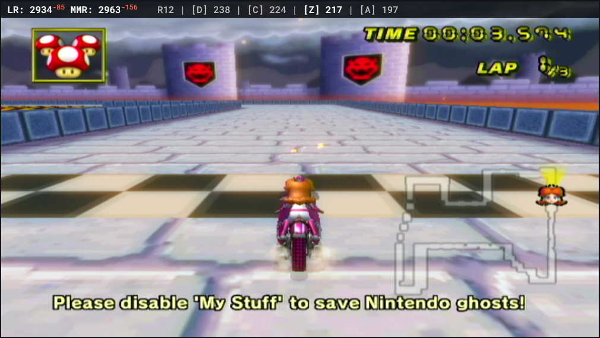

## A Dynamic MKW Tablebot Table Display for OBS
To To use this display, insert an MKW Tablebot table ID at the end of this url, replace the "TABLE-ID" text: https://blitzuuu.github.io/Table-Display/index?tableid=TABLE_ID

If you would like your team highlighted add &name=YOUR_LOUNGE_NAME to the end of the url.
For example, a url using my name would look something like this https://blitzuuu.github.io/Table-Display/index?tableid=1364434792455868426&name=blitzu

Add this link as a browser source in OBS to display the scores, they update as the table is updated with no need to refresh.

If you would like to change the text colour from black to white add "&white" to the end of the url, if you would like to alter the styling further these are the following relevant css elements:

`#table-stats` affects the colour and styling of the race number and dividers
`.team-normal` affects the colour and styling of all teams apart from the player's team (if the url has a name)
`.team-highlight` affects the colour and styling of the player's team (if the url has a name)

## Config Page
If you would like an OBS dock which can update the table ID without having to edit the link you can use the config page. This page requires a lounge name in the url as such: https://blitzuuu.github.io/Table-Display/config?name=YOUR_LOUNGE_NAME

On this page you can also switch between three alignments, Left, Right, and the Centered alignment which is specifically for tables with two teams (war tables), and can be customized to look more like a scoreboard. Two team tables still work perfectly fine with the Left or Right selections as well. 

Add this as a custom browser dock in OBS, and then add the index url with no table ID (e.g., https://blitzuuu.github.io/Table-Display/index?YOUR_LOUNGE_NAME). Make sure the name in both urls is the same. Now you can just insert a table ID and click the update button and it will update the link to display the table, to wipe it clear just click the reset button.

### Output
This is what the output looks like (*Note: I also have a semi-transparent black colour source behind my text in OBS to make it more readable*)



As well as the OBS dock


## War Layout Customization
The centered war layout is built from a small set of CSS selectors and a couple of variables — you can easily change colors, borders, and spacing by editing the selectors below.

### Customization — which CSS rules to change

Below are the exact CSS selectors used by the centered ("war") layout and examples showing how to change them for the items you asked about.

Notes:
- The centered layout uses an inline-flex wrapper `.war-center` that contains five cells (elements with class `.war-box` and modifiers `.tag`, `.score`, `.race`).
- For best results edit the CSS in `index.html` (or import a small extra CSS file) and keep the `.war-center` structure and child class names.

#### Change tag background colours
Selector:
- `.war-center .war-box.tag`

Example:
```css
/* current black */
.war-center .war-box.tag {
  background: #000000;
}

/* change to deep blue */
.war-center .war-box.tag {
  background: #1e90ff;
}
```

#### Change score background colours
Selectors:
- `.war-center .war-box.score` (applies to both left and right score cells)

Example:
```css
/* current grey */
.war-center .war-box.score {
  background: #6f6f6f;
}

/* change to dark green */
.war-center .war-box.score {
  background: #2f7a2f;
}
```

If you want different colors for left vs right score cells, you can add an extra class in the rendering code (e.g. `.score.left` / `.score.right`) or target them using :nth-child() on the wrapper, but adding explicit classes is clearer.

#### Change race count background colour
Selector:
- `.war-center .war-box.race`

Example:
```css
/* current light grey */
.war-center .war-box.race {
  background: #dcdcdc;
}

/* change to pale yellow */
.war-center .war-box.race {
  background: #fff5b1;
}
```

#### Turn borders on or off
The visible outer border is on the wrapper `.war-center`. Turn it off by removing or setting it to `none`.

Selector:
- `.war-center`

Turn border off:
```css
.war-center {
  border: none;
}
```

Turn border on (example):
```css
.war-center {
  border: 2px solid #333333; /* width, style, color */
}
```

If you want an inner divider between cells, add border-right on child boxes (but note your existing design uses flush cell backgrounds and a single outer border only).

#### Change border colour
Change the color part of the `.war-center` border rule:

```css
/* current dark grey */
.war-center {
  border: 2px solid #333333;
}

/* change to teal */
.war-center {
  border: 2px solid #008080;
}
```

You can change `2px` to a different width and `solid` to another style (dashed, dotted) if you like.

#### Change border roundness
The rounded corners are controlled by `border-radius` on the wrapper:

```css
/* current */
.war-center {
  border-radius: 6px;
}

/* make corners sharper */
.war-center {
  border-radius: 2px;
}

/* make corners more pill-like */
.war-center {
  border-radius: 12px;
}

/* fully pill */
.war-center {
  border-radius: 999px;
}
```

Note: the wrapper uses `overflow: hidden` so children backgrounds are clipped to match the rounded corners. If you remove `overflow: hidden`, the child backgrounds may stick out of the rounded corners.

### Horizontal spacing / text offset (scores alignment)
To make the left score text sit the same distance from its left cell wall as the right score sits from its right cell wall, the code uses internal padding on the text elements. The selector to change that distance is the CSS variable `--cell-hpad` and the alignment helper classes:

- `.left-align` (applies `padding-left: var(--cell-hpad)`)
- `.right-align` (applies `padding-right: var(--cell-hpad)`)
- `.center-align` (applies both left/right padding)

Example:
```css
:root {
  --cell-hpad: 12px; /* change this value to increase/decrease offset */
}
.left-align  { padding-left: var(--cell-hpad); }
.right-align { padding-right: var(--cell-hpad); }
```

Adjust `--cell-hpad` to make offsets larger or smaller.

### Making tag cells minimum width and grow for long tags
The JavaScript computing widths enforces a minimum number of characters for tag cells (currently 3 chars), then converts that into a pixel width using the monospace char measurement. If you prefer to control that in CSS you can instead set a CSS min-width on `.war-box.tag` (but note the current layout uses JS-calculated widths to keep pixel-perfect monospace sizing).

Example CSS-based fallback:
```css
/* enforce a min width (approx): */
.war-center .war-box.tag {
  min-width: 3ch; /* 'ch' uses width of '0' in the current font — may be close to monospace char width */
}
```

If you want to change the minimum from 3 to another value in the JS, adjust the `minTagChars` variable inside `renderWarCenter()` in `index.html`:
```js
const minTagChars = 3; // change this number
```

### Quick summary (selectors)
- Tag cell background: `.war-center .war-box.tag { background: ... }`
- Score cell background: `.war-center .war-box.score { background: ... }`
- Race cell background: `.war-center .war-box.race { background: ... }`
- Outer border toggle / color / width: `.war-center { border: 2px solid #333; }`
- Border roundness: `.war-center { border-radius: 6px; }`
- Score horizontal offset: change `--cell-hpad` in `:root` or `.left-align/.right-align`
- Minimum tag width: change `minTagChars` in `renderWarCenter()` or use CSS `min-width` like `min-width: 3ch;`
